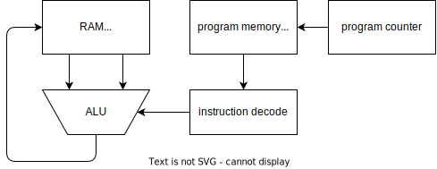

# xsig: eXtended signatures

**xsig** (eXtended signatures) is a library for specifying an authorization policy together with an evaluation engine. Something like "signatures on steroids" -- cryptographic signatures with finer-grained authorization conditions. Let's see some examples:

- "run this software only if at least two signatures are valid out of a set of 5 public keys" *(quorum-based authorization)*

- "run this software only on the HSM with serial number 12345 and if it is earlier than Jan 1st, 2042" *(per-device signing, time-bound authorization)*

- "accept this command if it's been signed by [two engineers and one manager] or [two vice-presidents]" *(slightly more complex access structure)*

## Components
**xsig** consists of two separate parts:

1. A minimalistic **domain-specific language** to express policy conditions, along with tooling to write and serialize these conditions. Using this language you can express an elaborate condition based on AND/OR combination of subconditions based off quora, time, etc.

2. An **evaluation engine** based on a simple interpreter. This interpreter is compact and suitable for embedding in bootloaders or other constrained environments like HSMs.

Using **xsig** saves you from writing the scary code that does policy enforcement and at the same time gives you a way to express / update / change policy conditions.

## Usage

The file [cmd/demo/demo.go](cmd/demo/demo.go) provides an end-to-end example of how to use this. Example output:
```
$ ./demo
2023/01/26 23:38:37 xpublickey: 0341c1537e2db0d543172e5057ad197d437cb0342997627066cf5fadb3e82e8dbc0031e1ffba2077f93c025132b577912aa6e22e201111597c164cf97241409e21ab040341c50205dea257248b617c1f1ca0d26385d0abff3a4a2ee97fcb79c587875b1ab4289cbedbd70095e1e88295d2e2f5f505ee53c4bd87ac99a53cf2a0b069a75361040341c2c004f2f9e217e9caef1dd1412a1dba520e1cd5fb021bdb134f58925d411faaa000a4ae7217ce326dfc9a475fb94d25282c98aeb73d591e4e229013b1a6cdf60403010203010305
2023/01/26 23:38:37 xsignature: 03485d2c7ca33bbde15fb490323e6469adc689d48dea81392b4706c2036b8c8b4bc2002102a2fe38b2bc01dce0ac913a9fafef3a748d042fcfaeeb6f1264f5cc13b330e38e002102463003478ed6588fd2a475b0de464cae8490e2dbaf5a7681544a93265c931ff3d956e7d5002102f3d5e480fcd8c13d740913fdb5ff2552180e1f45fa997904f042b23a2dde1c7120024530
2023/01/26 23:38:37 validates correctly
```

This example generates 3 ECDSA public/private keys and does the following things:
* generate an eXtended public key `xpublickey` that encodes the following meaning: "signature is valid if 2-of-3 signatures are valid from the following list of 3 public keys: pk1, pk2, pk3"
* generate an eXtended signature `xsignature` that packs two signatures and validates the previous `xpublickey`


## Interface

The current version of **xsig** basically implements the following function:

```
func Eval(xpublickey, xsignature, msg) -> {0,1}
```

Let's look at the arguments:
 * `xpublickey` is actually a policy (called "locking script" elsewhere), you can think of it as an "extended public key". In the simplest form, it _is_ just a public key.
 * `xsignature` is a statement that should satisfy the policy. This generalizes the idea of "signature" (also called "unlocking script").

The function returns 1 if `xsignature` is a valid "extended" signature for `msg` under `xpublickey`.

## Design

Under the hood, **xsig** embeds a simple interpreter in the spirit of Forth / inspired by Bitcoin script. We keep things very simple to make it easy to extend and reason about the security and correctness of the interpreter.
This is the order of execution for the function above:

1. Evaluate `xsignature`. This typically prepares the stack
1. Copy the data stack to a fresh new machine
1. Evaluate `xpublickey`
1. Succeed if the stack is exactly `[1]`, fail otherwise

To reason about correctness, consider `xsignature` completely untrusted and `xpublickey` trusted. Then, convince yourself there's no way to trick `xpublickey` to return a `[1]` other than by using the legitimate `xsignature`.

This machine that evaluates `xsignature` and `xpublickey` is very simple:
* Stack-oriented, not Turing-complete. Running time is bounded, every program is guaranteed to halt.
* The program counter increases every cycle by 1. There are no jump instructions, flow is always straight line.
* The program memory is different from the stack memory. There is no way to modify the program memory after initialization.
* The layout of the data stack is normally fixed before execution. Access beyond stack contents trip error handling.


Available opcodes:





## Available opcodes in Machine001

### Logic/Arithmetic

* `OP_ADD`: pop two 8-bit words from the stack, sum them and push the result back into the stack
* `OP_MUL`: idem
* `OP_AND`: idem
* `OP_OR`: idem
* `OP_NOT`: pop a 8-bit word from the stack, bitwise negate it, push the result back

### Data I/O
* `OP_PUSH <N> <X1> <X2> .. <XN>`: push `N` 8-bit words `X1 .. XN` into the stack, where `N` is the 8-bit word after `OP_PUSH`.

### Crypto
* `OP_SIGVERIFY`: pops a compressed public key from the stack, pops an ECDSA signature, push a 1 if signature validates, 0 otherwise.
* `OP_MULTISIGVERIFY`: pops 8-bit parameter N1, pops 8-bit parameter N2, pops N1 public keys, pops N2 signatures, validate the N2 signatures are valid under N2 different public keys, push a 1 if success, 0 otherwise.


**Other machines**. A future machine could introduce some minimal I/O mechanisms to run interactive protocols (think challenge-response for FA unlock, or absolute time synchronization, etc).


**WARNING**: Experimental research code.
Big bugs will bite.
Written by a single person with zero peer review.

## Future work

- [X] C interpreter
- [X] Multisignatures
- [ ] miniscript-like compiler
- [ ] semi-formal security argument / security verification
- [ ] delegation certs
- [ ] serial numbers / device unique string

## Contact

https://github.com/oreparaz/xsig
